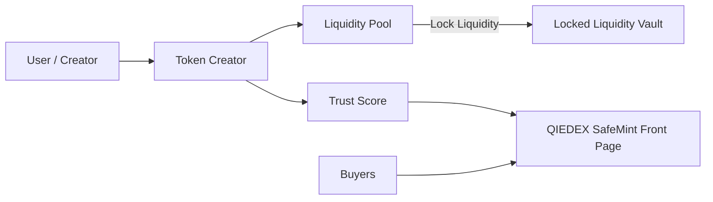

# SafeMint – Token Creation & Liquidity Platform using QIEDEX

SafeMint is a **free token creator and liquidity platform** built for the QIE blockchain that focuses on **killing scams, rug-pulls, and fake projects by design** with a real world impact.

Instead of letting anyone create dangerous tokens, QIEDEX enforces **fair launch, locked liquidity, and visible trust signals** from day one.

---
## How to Run the Project for Judges


### Option 1: Quick Start via Docker Hub (Recommended)
The easiest way to check the project is by pulling the pre-built image.

```bash
docker pull madhesh00/tokencreator-frontend
docker run -p 3000:3000 madhesh00/tokencreator-frontend
```
*   **Access the App:** Open `http://localhost:3000`

### Option 2: Run via Docker Compose (Build Locally)
If you want to build the latest version from the source code directly.

1.  **Clone the Repository** (if you haven't already):
    ```bash
    git clone https://github.com/hari-hara-sudharsan/Blockchain-TokenCreator.git
    cd Blockchain-TokenCreator
    ```
2.  **Run with Docker Compose**:
    ```bash
    docker-compose up --build
    ```
*   **Access the App:** Open `http://localhost:3000`

### Option 3: Manual Setup (Development Mode)
If you prefer running without Docker/Containers.

1.  **Clone the Repository**:
    ```bash
    git clone https://github.com/hari-hara-sudharsan/Blockchain-TokenCreator.git
    cd Blockchain-TokenCreator/frontend
    ```
2.  **Install Dependencies**:
    ```bash
    cd frontend
    npm install
    npm run dev
    ```
   
    Open a new terminal to deploy contracts:
    
    ```bash
    cd contract
    npx hardhat compile
    npx hardhat run scripts/deploy-factory.js --network qie_testnet
    
    ```
    
*   **Access the App:** Open `http://localhost:3000` (or the port shown in terminal)

---

## Workflow Explained (Very Simple)

### Step 1 – Token Creation

User creates a token using QIEDEX’s free creator.

### Step 2 – Fair Launch Enforcement

Creator receives *0 pre-mine*.
Tokens are only obtained by buying or adding liquidity.

### Step 3 – Liquidity Lock

100% of provided liquidity is *automatically locked* for 6–12 months.

### Step 4 – Public Trading

Users instantly know whether a token is safe before buying.

---

## High-Level Architecture




---

## Core Features

| Feature                               | What It Does (Super Simple)       | Which Pain Points It Kills |
| ------------------------------------- | --------------------------------- | -------------------------- |
| Mandatory 6–12 Month Locked Liquidity | Liquidity cannot be removed early | Kills rug-pulls forever    |
| Fair Launch by Default                | Creator gets 0 pre-mine           | Kills hidden dev wallets   |
| Public Trust Display                  | Safety shown on front page        | Users decide in 1 second   |
| Real Asset Mode                       | Locked team tokens + identity     | Enables serious projects   |

---

## Prerequisites

Make sure you have:

- Node.js **v18 or above**
- npm
- Git
- Docker

---

## What Makes QIEDEX SafeMint Different

| # | Difference | What It Means (Simple) | Why It Matters |
| - | ---------- | ---------------------- | -------------- |
| 1 | No Rug Possible | Liquidity cannot be removed early | Users cannot be scammed |
| 2 | Mandatory Fair Launch | Creator gets zero pre-mine | No hidden dev advantage |
| 3 | Scam Flagging | Risky tokens are marked clearly | Scammers lose visibility |
| 4 | Serious Asset Support | Real projects get safer launch rules | Real money can enter |

---

## What Is Included

| # | Feature | What It Does | Why It Is Important |
| - | ------- | ------------ | ------------------- |
| 1 | Free Token Creator | Create tokens without cost | Low barrier to entry |
| 2 | Auto-Locked Liquidity | Liquidity is locked by default | Prevents rug pulls |
| 3 | Fair Launch Enforcement | No pre-mine allowed | Equal start for everyone |
| 4 | Real-Asset Launch Mode | Supports serious use cases | Attracts real projects |
| 5 | Public Safety Signals | Safety shown on front page | Reduces user confusion |

---

## Real Pain Points This Solves

| # | Pain Point        | What Happens Today          | Why It Kills Projects   |
| - | ----------------- | --------------------------- | ----------------------- |
| 1 | Zero Liquidity    | Token exists but no trading | Token becomes worthless |
| 2 | Rug Pulls         | Dev removes liquidity       | Users lose everything   |
| 3 | Fake Volume       | Dev trades with self        | Investors get trapped   |
| 4 | No Real Use       | Meme tokens only            | Tokens die in days      |
| 5 | Impermanent Loss  | LPs lose money              | Liquidity disappears    |
| 6 | Scam Flood        | 99% fake tokens             | Users leave ecosystem   |
| 7 | No Serious Assets | No compliance tools         | Big money never enters  |

---
## Resources and Documentations

- [QIE Official Docs](https://docs.qie.digital/)
- [QIE Developer Docs](https://docs.qie.digital/developer-docs)
- [QIE Github](https://github.com/Qi-Blockchain)
- [QIE Mainnet](http://www.mainnet.qie.digital/)
- [QIEDEX](https://youtu.be/_lySE370sGk?si=CONBADOBCu5NqfqC)

---
## License

MIT
